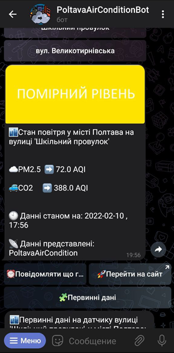
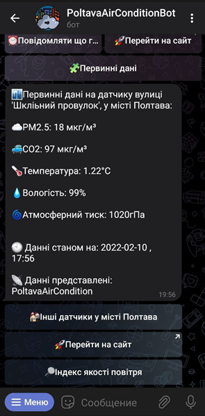
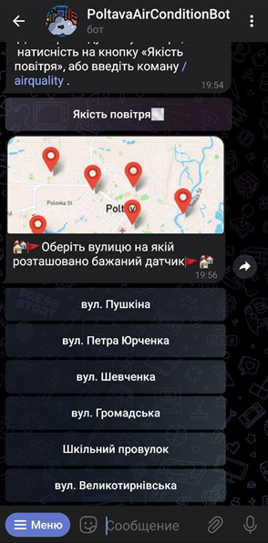

# PoltavaAirConditionBot
PoltavaAirConditionBot🤖 is a multy functional asynchronos Telegram Bot wich was developed and launched as addition to [PoltavaAirCondition](https://github.com/KytryshAndrii/PoltavaAirCondition) project.

## Important fakts about bot:
* It was wrtiten using [aiogram](https://aiogram.dev/) async library.
* Bot using http requests to get air quolity data from PoltavaAirCondition page.
* Bots functionality allows to create data charts of air quolity parameters for last 24 hours.

## Bots interface:

